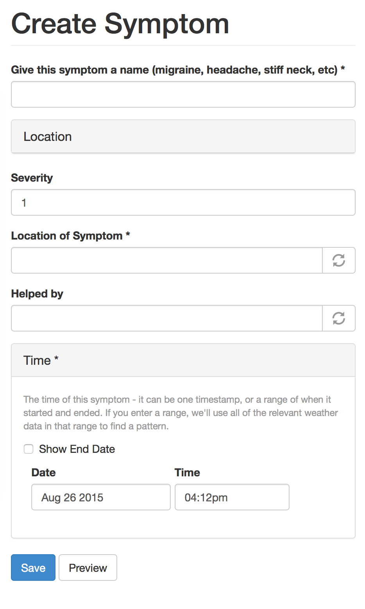
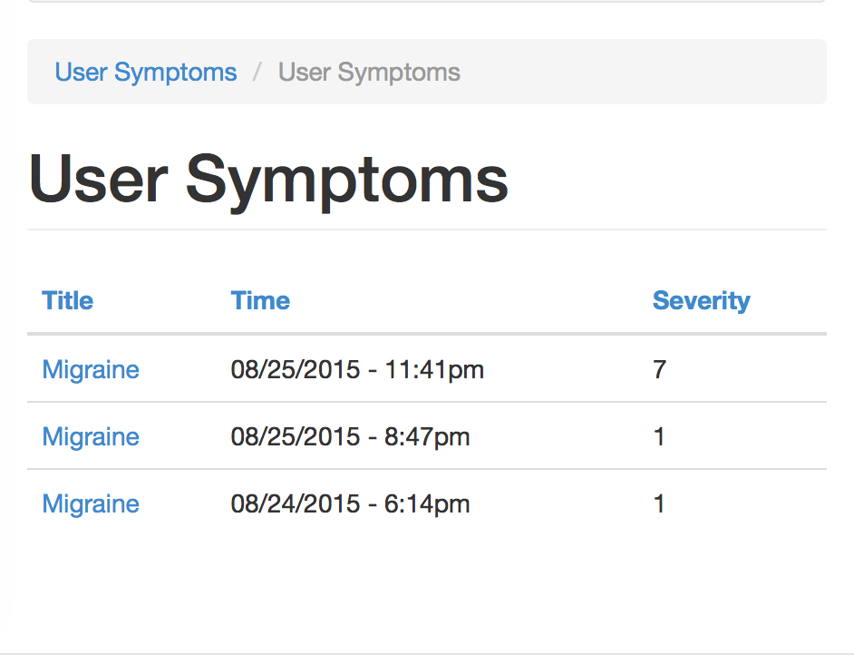

# weather-symptoms
Beginning of a project to track weather data against headache symptoms &amp; find patterns.  

## Weather & Health

I came up with the idea for this project because my chronic migraines are made ever more miserable when the weather is bad - and in Southern California, that's not often, but these migraines are horrendous, and I just can't seem to get a handle on them. I know that it's something about the weather - but what? The idea behind this site is to track your symptom - any symptom - and give us your location, and we'll get the weather for that time and place.

I'm not sure yet how the data analysis will go, so while I work on that, I think the first phase of this site will be to show weather patterns previous to symptoms you log, and let you look at them. Eventually, I want the system to be able to process all of this data and say "hey, you logged a symptom when A, B, and C, happened, so I see A, B, and C happening next week, I think that's going to trigger a symptom for you."
The hard part here is that I don't know what the patterns are, so I need to teach the system to look for patterns, and then analyze them. For this, we'll need a lot of data, so the more people who can help beta-test this thing, the better!

Weather is one thing we certainly can't control, but if we can get more information and be prepared, that's something!

## Functionality
Users will be able to enter basic data, including a location for each symptom. These will be logged, along with the weather for each node. The surrounding weather data will then be analyzed to find patterns that may predict future symptoms.  

Using [OpenWeatherMap PHP API](https://github.com/cmfcmf/OpenWeatherMap-PHP-Api/tree/master) to connect to [Open Weather Map](http://www.openweathermap.org/).

##Examples

Sample symptom entry form:

Sample table of user's entries: 
